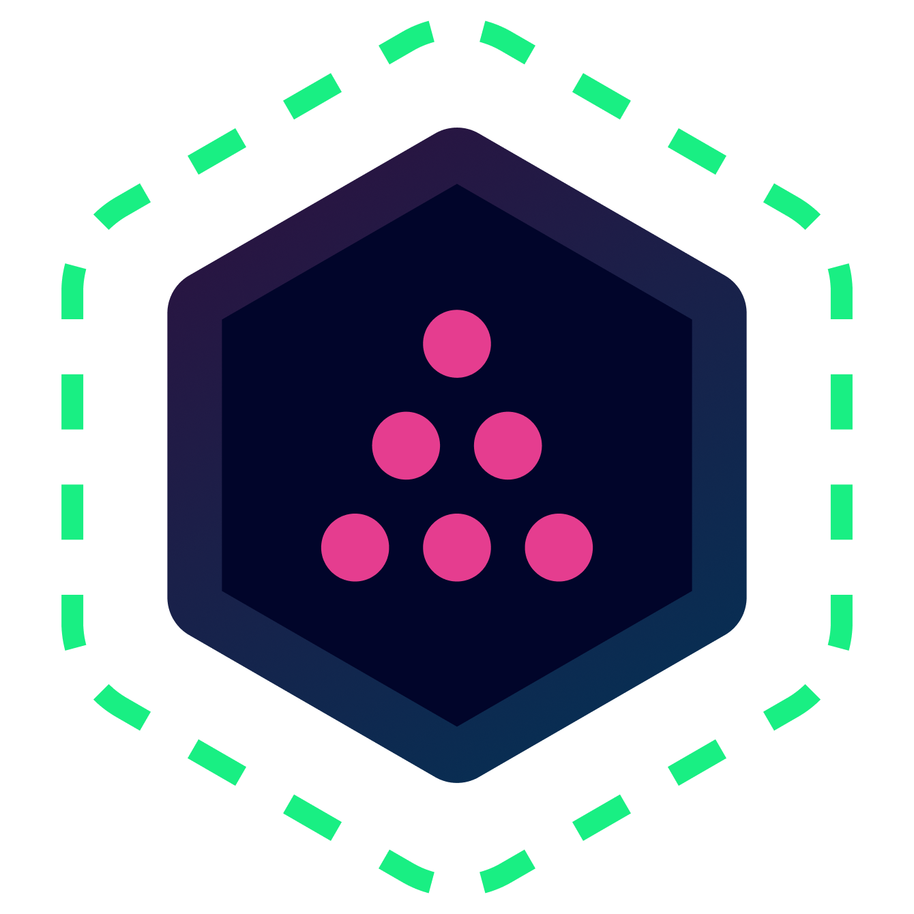

<p align="center">
  
</p>

<h1 align="center">AGNT</h1>

<p align="center">
  <strong>The local-first agent operating system for workflows, goals, memory, plugins, subagents, evals, and self-improving AI work.</strong>
</p>

<p align="center">
  <em>Chat when you need judgment. Use workflows when you need repeatability. Set goals when you want AGNT to keep working. Delegate when work should happen in parallel.</em>
</p>

<p align="center">
  
  
  
  
  
</p>

<p align="center">
  
  
  
  
  
  
  
  
</p>

<p align="center">
  <a href="https://agnt.gg">🌐 Website</a> ·
  <a href="#-what-is-agnt">🧠 What is AGNT?</a> ·
  <a href="#-the-runtime-model">🧩 Runtime model</a> ·
  <a href="#-complete-feature-map">✨ Features</a> ·
  <a href="#-installation">📦 Install</a> ·
  <a href="docs/_API-DOCUMENTATION.md">📚 API Docs</a> ·
  <a href="#-plugin-development">🔌 Plugins</a> ·
  <a href="https://discord.gg/agnt">💬 Discord</a>
</p>

---

## 🧠 What is AGNT?

AGNT is a **local-first agent operating system**: a desktop app and self-hostable backend for building, running, evaluating, and evolving AI work.

It brings agents, workflows, goals, tools, memory, plugins, evals, traces, messaging, and APIs into one local workspace.

That is the product: **AI work becomes durable, inspectable, repeatable, and improvable.**

---

## ⚡ The short version

AGNT gives you:

- 🤖 **Agents** — memory, tools, skills, providers, and streaming chat.
- 🧩 **Workflows** — 60+ nodes, triggers, branches, checkpoints, and nesting.
- 🎯 **Goals** — plan, execute, evaluate, re-plan, pause, resume, and revert.
- 👥 **Subagents** — delegate across agents, workflows, async tools, MCP, plugins, APIs, and parallel branches.
- 📣 **Event automation** — Telegram, Discord, Slack, email, Gmail, webhooks, schedules, Zapier, and custom APIs.
- 🧠 **Memory + insights** — facts, preferences, corrections, bottlenecks, patterns, and tool choices.
- 🧬 **SkillForge** — turn execution traces into better reusable skills.
- 🔌 **Plugins** — `.agnt` packages with tools, triggers, widgets, hot reload, and marketplace distribution.
- 🛠️ **Local API** — port `3333` for agents, workflows, goals, tools, files, plugins, MCP, skills, insights, and executions.
- ⚡ **Real-time UX** — SSE streams and Socket.IO updates.
- 🗄️ **Local-first storage** — SQLite plus filesystem data you control.
- 🧠 **Provider freedom** — OpenAI, Anthropic, Gemini, Grok, Groq, Cerebras, DeepSeek, OpenRouter, Together, Kimi, MiniMax, Z.AI, local CLI auth, and custom endpoints.
- 🖥️ **Run anywhere** — desktop, Docker, headless server, VPS, homelab, Raspberry Pi, local files, CLIs, browser automation, MCP, and custom APIs.

---

## ⚡ Quick start

```bash
git clone https://github.com/agnt-gg/agnt.git
cd agnt

npm install
cd frontend && npm install && cd ..

npm start
```

For development with frontend hot reload:

```bash
# Terminal 1
cd frontend
npm run dev

# Terminal 2
npm start
```

The local backend runs on:

```text
http://localhost:3333
```

---

## 🧭 Choose your install path

| You want to... | Use this |
|---|---|
| Try AGNT locally | `npm install` then `npm start` |
| Develop the UI/backend | Vite dev server + Electron/backend |
| Run AGNT as a local server | Build frontend, then `npm start` |
| Self-host on a VPS, homelab, or Raspberry Pi | Docker Lite |
| Use browser automation | Docker Full |
| Build plugins | Clone repo + `backend/plugins/dev` templates |
| Script AGNT from other tools | Local API at `http://localhost:3333/api` |

Most developers should start with the Quick start above, then use Docker or headless mode once they know how they want to run AGNT.

---

## ✅ Does AGNT fit your use case?

Use AGNT if your work needs:

- 📥 events that trigger AI work
- 🔁 repeatable automations
- 🎯 long-running objectives
- 👥 delegated work across agents, tools, APIs, and workflows
- 🧠 memory across runs
- 📜 inspectable traces, costs, outputs, and decisions
- 🔌 custom tools, plugins, MCP, or provider auth
- 🖥️ local or self-hosted ownership

Probably not if you only need:

- 💬 a hosted chatbot
- 🧪 a prompt playground
- ☁️ a SaaS-only automation tool
- 🏢 public multi-tenant hosting for unrelated organizations
- 🪄 a zero-config cloud product with no local data, APIs, plugins, or providers

---

## 🆚 How AGNT compares

AGNT overlaps with agent frameworks, workflow tools, plugin ecosystems, and self-improving skill systems. Its strength is the union.

| If you are comparing AGNT to... | The difference |
|---|---|
| **Hermes Agent** | Hermes is a narrower autonomous-agent framework. AGNT can run the same single-agent style of work, then go further: multi-agent systems, visual workflows, long-running goals, plugins, evals, traces, dashboards, provider management, APIs, messaging triggers, custom tools, local memory, and local-first persistence. |
| **OpenClaw** | OpenClaw focuses on CLI-driven tool use. AGNT includes tool use, then adds a desktop app, local backend, visual workflows, goals, plugins, evals, dashboards, provider management, messaging triggers, MCP, custom APIs, and persistent local state. |
| **n8n / Zapier** | AGNT has visual automation, but also persistent agents, memory, goals, SkillForge, MCP, provider auth, local traces, custom APIs, and plugin-native AI execution. |
| **LangChain / AutoGen / CrewAI** | AGNT is not just a framework. It includes the desktop UI, local backend, workflow canvas, goals, plugins, storage, dashboards, and runtime APIs. |
| **OpenWebUI / chat apps** | AGNT has chat, but chat is only one execution mode. Workflows, goals, tools, plugins, memory, and evals are first-class. |
| **Claude Code / coding agents** | AGNT can work with local projects and tools, but also orchestrates workflows, messaging triggers, custom APIs, dashboards, skills, and long-running goals. |

Other tools cover fragments of the stack. **AGNT is the full local-first agent operating system.**

---

## 📦 Installation

### ✅ Prerequisites

- Node.js 18+
- npm 9+
- Git

### 🚀 Quick install from source

```bash
git clone https://github.com/agnt-gg/agnt.git
cd agnt

npm install
cd frontend && npm install && cd ..

npm start
```

### 🧑‍💻 Development mode

```bash
# Terminal 1: frontend dev server with Vite HMR
cd frontend
npm run dev

# Terminal 2: Electron app and backend on port 3333
npm start
```

### 🏭 Production mode

```bash
cd frontend && npm run build && cd ..
npm start
```

## 🐳 Docker install

Use Docker for an isolated self-hosted deployment.

> **Docker snap users on Linux:** If you installed Docker via snap, set `AGNT_HOME` with an absolute path, for example `AGNT_HOME=/home/username docker compose up -d`, to avoid snap home directory isolation issues.

> **Updating an existing Docker deployment:** `docker compose up -d` alone does not always fetch a newer image when the tag already exists locally. Run `docker compose pull` first, or use `docker compose up -d --pull always`.

### 📥 Pull pre-built images from GHCR

```bash
# Full image with browser automation, about 1.5GB
docker run -d \
  --name agnt-full \
  -p 3333:3333 \
  -v agnt-data:/app/data \
  ghcr.io/agnt-gg/agnt:latest

# Visit http://localhost:3333
```

```bash
# Lite image without browser automation, about 715MB
docker run -d \
  --name agnt-lite \
  -p 3333:3333 \
  -v agnt-data:/app/data \
  ghcr.io/agnt-gg/agnt:lite

# Visit http://localhost:3333
```

Available tags:

- `latest` / `full`: latest Full variant with browser automation
- `lite`: latest Lite variant without browser automation
- `v0.5.16` / `v0.5.16-full`: specific Full version
- `v0.5.16-lite`: specific Lite version

### 🏗️ Build Docker images from source

```bash
git clone https://github.com/agnt-gg/agnt.git
cd agnt

# Full version
docker-compose up -d

# Lite version
docker-compose -f docker-compose.lite.yml up -d

# Run both variants side by side
docker-compose -f docker-compose.both.yml up -d

# Or use the Makefile
make run-both
```

### 🧪 Docker variants

- 🔋 **Full**: includes Chromium support for web scraping and browser automation.
- 🪶 **Lite**: smaller image without browser automation.
- 🚀 **Both**: useful for testing Full and Lite side by side.

📖 See [Self-Hosting Guide](docs/SELF_HOSTING.md) for complete Docker setup.

---

## 📥 Desktop binaries

Pre-built desktop downloads are available for Windows, macOS, and GNU/Linux.

<p align="center">
  <a href="https://agnt.gg/downloads/">
    
  </a>
  <a href="https://agnt.gg/downloads/">
    
  </a>
  <a href="https://agnt.gg/downloads/">
    
  </a>
</p>

---

### 🖥️ Headless / $5 VPS / Raspberry Pi mode

AGNT can run without the Electron desktop shell. In headless mode the Express backend serves the built Vue frontend and the local API from port `3333`, so you can run AGNT on a homelab box, a Raspberry Pi, a small cloud VM, or a low-cost VPS.

For a typical $5 VPS or Raspberry Pi, use the Lite Docker image unless you need browser automation. Lite keeps agents, workflows, goals, plugins, providers, API integrations, file processing, image processing, and email automation, but omits bundled Chromium/Puppeteer/Playwright browser automation to reduce disk and memory use.

Recommended small-server targets:

| Target                     | Recommendation                                             |
| -------------------------- | ---------------------------------------------------------- |
| $5 VPS                     | 1-2 vCPU, 1-2GB RAM, Ubuntu 22.04/24.04, Lite image        |
| Raspberry Pi 5             | 8GB RAM recommended, 64-bit OS, Lite image                 |
| Raspberry Pi 4             | 4GB minimum, 8GB preferred, 64-bit OS, Lite image          |
| Mini PC / NUC / old laptop | Lite or Full depending on RAM and browser automation needs |

For Raspberry Pi, use a **64-bit OS** such as Raspberry Pi OS 64-bit or Ubuntu Server arm64. SSD storage is strongly preferred over a microSD card for always-on use. The Docker images are intended for multi-arch publishing; use `ghcr.io/agnt-gg/agnt:lite` on ARM64 devices when available.

```bash
# On a fresh Ubuntu VPS, homelab server, or Raspberry Pi OS 64-bit install
curl -fsSL https://get.docker.com | sh
sudo usermod -aG docker $USER
newgrp docker

# Create persistent data directories
mkdir -p ~/.agnt/data ~/.agnt/logs/lite

# Generate production secrets
export JWT_SECRET=$(openssl rand -base64 32)
export SESSION_SECRET=$(openssl rand -base64 32)
export ENCRYPTION_KEY=$(openssl rand -base64 32)

# Run AGNT Lite headlessly on port 3333
docker run -d \
  --name agnt \
  --restart unless-stopped \
  -p 3333:3333 \
  -e NODE_ENV=production \
  -e AGNT_LITE_MODE=true \
  -e JWT_SECRET="$JWT_SECRET" \
  -e SESSION_SECRET="$SESSION_SECRET" \
  -e ENCRYPTION_KEY="$ENCRYPTION_KEY" \
  -v "$HOME/.agnt/data:/app/data" \
  -v "$HOME/.agnt/logs/lite:/app/logs" \
  ghcr.io/agnt-gg/agnt:lite
```

Then open:

```text
http://YOUR_SERVER_IP:3333
```

For public internet deployments, put AGNT behind HTTPS with a reverse proxy, Cloudflare Tunnel, Tailscale, or another access layer you control. Do not leave production secrets as `CHANGE_ME_IN_PRODUCTION`.

If you need browser automation, use the Full image instead:

```bash
docker run -d \
  --name agnt \
  --restart unless-stopped \
  -p 3333:3333 \
  -v "$HOME/.agnt/data:/app/data" \
  -v "$HOME/.agnt/logs/full:/app/logs" \
  ghcr.io/agnt-gg/agnt:latest
```

The Full image is larger and is better suited to a VPS, mini PC, or Pi with more RAM and swap. On very small machines, add swap or use Lite.

You can also run headless from source:

```bash
git clone https://github.com/agnt-gg/agnt.git
cd agnt
npm install
cd frontend && npm install && npm run build && cd ..
PORT=3333 npm run dev
```

`npm run dev` starts `node backend/server.js`; if `frontend/dist` exists, the backend serves the web UI as well as the API.

---

## 🖼️ Screenshots

<p align="center">
  
  
</p>
<p align="center">
  
  
</p>
<p align="center">
  
  
</p>

---

## ⭐ Star history

<p align="center">
  <a href="https://star-history.com/#agnt-gg/agnt&Date">
    
  </a>
</p>

---

## 🧩 The runtime model

AGNT is built around three execution modes.

| Mode          | Use it when                                                         | What AGNT provides                                                                                       |
| ------------- | ------------------------------------------------------------------- | -------------------------------------------------------------------------------------------------------- |
| **Agents**    | You need judgment, language, reasoning, tool use, or collaboration. | Persistent chat, memory, tools, skills, streaming, traces, token and cost accounting.                    |
| **Workflows** | You need repeatable automation.                                     | A visual DAG engine, triggers, 60+ nodes, checkpoints, versioning, nested workflows, live status.        |
| **Goals**     | You need an objective pursued over time.                            | Planning, task decomposition, execution, evaluation, re-planning, pause/resume/revert, golden standards. |

The three modes are designed to feed each other.

A chat can delegate to a tool. A workflow can call an agent. A goal can run tasks, evaluate results, and use the traces to improve a skill. A plugin can add new capabilities to every layer. A dashboard can display the outputs. The local API can drive it all from outside the UI.

---

## 👥 Delegation graphs: AGNT's subagent model

AGNT supports subagent-style delegation natively.

A delegated workstream in AGNT can be:

- another AGNT agent
- a goal task assigned to a specialized agent
- a workflow branch running in parallel
- a nested workflow
- an async background tool run
- a plugin tool
- an MCP tool
- a Telegram, Discord, Slack, email, webhook, or scheduled trigger
- a custom API call
- a human approval step
- an evaluation step

Example:

```text
Goal: launch a product announcement
  ├─ Research agent gathers source material
  ├─ Copy agent drafts messaging
  ├─ Design workflow creates visuals
  ├─ Engineering agent edits files
  ├─ QA agent reviews output
  ├─ Evaluation node scores the result
  └─ SkillForge extracts reusable lessons
```

AGNT does not stop at spawning workers. Every workstream can have durable execution records, local database state, tool-call traces, token and cost accounting, retries, pause/resume/revert, human approval gates, memory extraction, skill evolution, plugin access, dashboard visibility, and API access.

That is the difference between a single autonomous agent and an agent operating system.

---

## 🎯 Why AGNT exists

AI agents fail when they are trapped in disposable chats.

They need durable state, trusted tools, repeatable workflows, memory, evaluation, provider access, human approval, plugins, and a runtime that can keep working after the chat ends.

AGNT supplies that runtime.

### 🏠 Local-first by design

Agents, workflows, goals, skills, traces, insights, provider settings, plugins, and dashboards live under your AGNT data directory unless you explicitly publish, sync, or call an external service.

### 🧬 Extensible and self-improving

AGNT can install, build, AI-generate, hot reload, share, or keep private agents, workflows, tools, widgets, plugins, skills, evals, marketplace items, and MCP servers.

Every run can become reusable signal:

```text
messages + tool calls + costs + errors + outputs + evals → insights → memory → skills
```

---

## 🧱 Core building blocks

- 🤖 **Agents** — persistent AI workers.
- 🧩 **Workflows** — visual DAG automations.
- 🎯 **Goals** — autonomous objectives.
- 🧠 **Skills** — reusable instructions.
- 🔌 **Plugins** — packaged extensions.
- 📊 **Widgets** — custom dashboards.
- 🧪 **Experiments** — eval and benchmark runs.
- 💡 **Insights** — extracted lessons and memory.
- 🌐 **MCP servers** — external tool providers.

---

## 🛠️ The Forge system

Create core assets with AI:

- 🤖 **Agent Forge** — agents from natural language
- 🧩 **Workflow Forge** — complete workflow graphs
- 🛠️ **Tool Forge** — custom tools
- 📊 **Widget Forge** — HTML/CSS/JS dashboards
- 🔌 **Plugin Forge** — scaffolded `.agnt` plugins
- 🧬 **SkillForge** — skills from execution traces

AGNT is not just where agents run. It is where the workspace helps build itself.

---

## ✨ Feature map

- 🧠 **Memory and learning** — facts, preferences, corrections, insights, SkillForge, datasets, and experiments.
- 🧩 **Automation** — visual workflows, triggers, branches, nested workflows, timers, webhooks, and messaging.
- 🎯 **Autonomy** — goals, planning, evaluation, rollback, AGI loop, and review states.
- 🔌 **Extensibility** — plugins, tools, widgets, MCP, custom APIs, and marketplace assets.
- 📜 **Observability** — traces, tool calls, node events, costs, queues, and provider health.
- 🖥️ **Runtime** — desktop, local API, Docker, headless mode, VPS, homelab, and Raspberry Pi.
- 💻 **Workspace** — files, code editor, browser automation, media, speech, and dashboards.

---

## 📦 Built-in tool library

AGNT ships with 60+ workflow nodes and tool actions before plugins.

### 🎬 Triggers

`google-sheets-new-row` · `receive-discord-message` · `receive-slack-message` · `zapier-trigger` · `receive-email` · `trigger-timer` · `webhook-listener`

### ⚙️ Actions

**Communication:** Discord, Slack, Gmail, Send Email, Twitter/X, Zapier.

**Productivity:** Notion, Google Drive, Google Sheets, Google Slides, Dropbox, GitHub.

**Content and media:** Firecrawl, Unsplash, YouTube, Web Scrape, Web Search, Text-to-Speech.

**Commerce:** Stripe Invoice.

**AI and automation:** multi-provider LLM generation, browser automation, AGNT agent delegation, AGNT API calls, MCP client calls, custom HTTP APIs, Slop Connector, Unturf AI.

### 🧮 Utilities

`execute-javascript` · `execute-python` · `database-operation` · `data-transformer` · `file-system-operation` · `counter` · `random-number` · `label` · `hello-world`

### 🎛️ Control flow

`delay` · `for-loop` · `parallel-execution` · `run-workflow`

### 📺 Display widgets

`audio-preview` · `chart-preview` · `code-preview` · `html-preview` · `image-preview` · `markdown-preview` · `media-preview` · `pdf-preview`

Everything installed from the marketplace or built as a plugin extends this library.

---

## 🤖 Supported AI providers

AGNT uses a pluggable provider layer.

| Provider          | Example model families                           | Auth method                            |
| ----------------- | ------------------------------------------------ | -------------------------------------- |
| **OpenAI**        | GPT-4o, GPT-4 Turbo, GPT-3.5, o1, o3             | API key                                |
| **Anthropic**     | Claude 4, Claude 3.5 Sonnet, Claude 3 Opus/Haiku | API key                                |
| **Google Gemini** | Gemini 1.5/2.0 Pro, Flash, Ultra                 | API key                                |
| **Grok AI**       | Grok-1, Grok-2                                   | API key                                |
| **Groq**          | Llama, Mixtral, fast inference models            | API key                                |
| **Cerebras**      | Ultra-fast inference models                      | API key                                |
| **DeepSeek**      | DeepSeek Coder, DeepSeek Chat                    | API key                                |
| **OpenRouter**    | 100+ routed models                               | API key                                |
| **Together AI**   | Open source model families                       | API key                                |
| **Kimi**          | Kimi models, including Kimi Code                 | API key                                |
| **MiniMax**       | MiniMax models                                   | API key                                |
| **Z.AI**          | Z.AI models                                      | API key                                |
| **Claude Code**   | Claude through local CLI auth                    | OAuth PKCE / token                     |
| **OpenAI Codex**  | Codex through local CLI auth                     | Device auth                            |
| **Gemini CLI**    | Gemini through local CLI auth                    | OAuth loopback / API key / GCP project |
| **Custom**        | Any OpenAI-compatible endpoint                   | Configurable                           |

Connection health is monitored in real time with cached status and live checks for dashboards and alerts.

---

## 🏗️ Architecture

AGNT is a desktop shell, a Vue application, and a local Express runtime backed by SQLite and the filesystem.

```text
┌──────────────────────────────────────────────────────────────┐
│              Electron Shell: Windows / macOS / Linux          │
│    Native menus · auto-update · IPC bridge · deep links        │
└──────────────────────────────────────────────────────────────┘
                              ↕ IPC
┌──────────────────────────────────────────────────────────────┐
│                  Vue 3 Frontend: Vite                         │
│  Terminal UI · Workflow Canvas · Forges · Marketplace · Chat   │
└──────────────────────────────────────────────────────────────┘
                              ↕ HTTP / SSE / WebSocket
┌──────────────────────────────────────────────────────────────┐
│                  Express Backend: port 3333                   │
├──────────────────────────────────────────────────────────────┤
│  Agent Runtime   │ Workflow Engine │ Goal Engine / AGI Loop   │
│  Orchestrator    │ SkillForge      │ Evolution Engine         │
│  Plugin Loader   │ MCP Client      │ Provider Auth Dispatcher │
│  Async Tools     │ Email Listener  │ Webhook Dispatcher       │
│  Filesystem      │ Speech Service  │ Version Service          │
├──────────────────────────────────────────────────────────────┤
│  SQLite: agents · workflows · goals · memories · skills       │
│  insights · versions · executions · traces · providers        │
└──────────────────────────────────────────────────────────────┘
```

### 🔌 Local API surface

The backend mounts a broad local API. Important route families include:

| Prefix                                                                | Responsibility                                              |
| --------------------------------------------------------------------- | ----------------------------------------------------------- |
| `/api/agents`                                                         | Agent CRUD, chat, runtime surfaces.                         |
| `/api/orchestrator`                                                   | Universal chat/orchestration streams.                       |
| `/api/workflows`                                                      | Workflow CRUD, start/stop/status.                           |
| `/api/executions`                                                     | Workflow execution records.                                 |
| `/api/goals`                                                          | Goals, autonomous execution, evaluation.                    |
| `/api/tools` and `/api/tool-schemas`                                  | Tool discovery, schemas, execution metadata.                |
| `/api/providers` and `/api/models`                                    | Provider auth, connected apps, model metadata.              |
| `/api/plugins`                                                        | Plugin install, uninstall, reload, local marketplace flows. |
| `/api/mcp`                                                            | MCP server management and capability discovery.             |
| `/api/skills`, `/api/skillforge`, `/api/experiments`, `/api/insights` | Skill, evolution, evaluation, and learning systems.         |
| `/api/filesystem`, `/api/images`, `/api/local-file`, `/api/speech`    | Local media and system services.                            |
| `/api/webhooks`, `/api/email-listeners`                               | External triggers.                                          |
| `/api/stream`                                                         | Stream engine endpoints.                                    |

The result is simple: what the UI can do, other local tools can often script.

---

## 👥 Who AGNT is for

AGNT is built for trusted local workspaces.

Good fits:

- ✅ single users running AGNT on a personal machine
- ✅ families sharing a backend across household devices
- ✅ small teams of 2 to 10 people sharing one workspace
- ✅ developers who want a local agent backend they can inspect and extend
- ✅ automation builders who need visual workflows plus AI judgment
- ✅ power users who want durable agents instead of throwaway chats

Bad fits:

- ❌ public multi-tenant SaaS
- ❌ hosting unrelated organizations on one shared instance
- ❌ large enterprises with 50+ concurrent users
- ❌ zero-trust tenant isolation requirements

AGNT uses SQLite and real-time broadcast sync. It is excellent for a trusted workspace. It is not designed to isolate thousands of unrelated organizations.

---

## 🗂️ Data directory structure

AGNT chooses a data directory based on how it is running.

| Run mode                      | Data directory                                                                          |
| ----------------------------- | --------------------------------------------------------------------------------------- |
| Electron desktop on Windows   | `%APPDATA%\AGNT\Data\`                                                                  |
| Electron desktop on macOS     | `~/Library/Application Support/AGNT/Data/`                                              |
| Electron desktop on Linux     | `~/.config/AGNT/Data/`                                                                  |
| Docker                        | `/app/data` inside the container, usually mounted from `${AGNT_HOME:-$HOME}/.agnt/data` |
| Direct clone with `npm start` | `~/.agnt/data/`, override with `AGNT_HOME`                                              |

Important paths:

- `<data-dir>/agnt.db`: SQLite database.
- `<data-dir>/plugins/installed/`: installed plugins.
- `<data-dir>/_logs/`: logs for Electron and direct clone.
- `${AGNT_HOME:-$HOME}/.agnt/logs/`: Docker logs.

Electron keeps a few historical files one level up at `%APPDATA%\AGNT\`, including `mcp.json`, `code-settings.json`, `projects/`, and `_logs/`.

---

## 🔐 Environment and secrets

Copy the example environment file before running Docker or production setups.

```bash
cp .env.example .env
```

Optional location overrides:

```env
# Override default data location
# AGNT_HOME=/home/youruser

# Docker only, normally set by docker-compose.yml
# APP_PATH=/app
```

Production secrets should be changed.

```env
JWT_SECRET=your-random-jwt-secret
SESSION_SECRET=your-random-session-secret
ENCRYPTION_KEY=your-random-encryption-key
```

Generate secure values with:

```bash
openssl rand -base64 32
```

See `.env.example` for provider keys, OAuth settings, and plugin configuration.

---

## 🏗️ Building for distribution

```bash
# Current platform
npm run build

# Platform-specific builds
npm run build:win
npm run build:mac
npm run build:linux

# All platforms
npm run build:all
```

### 🪶 Lite desktop builds

```bash
npm run build:lite
npm run build:lite:win
npm run build:lite:mac
npm run build:lite:linux

# Build Full and Lite
npm run build:both
npm run build:both:win
npm run build:both:mac
npm run build:both:linux
```

Lite mode removes browser automation source code. Agents, workflows, API integrations, plugins, image processing, and email automation still work.

📖 See [Electron Lite Mode Guide](docs/ELECTRON_LITE_MODE.md).

---

## 🚢 Releasing a new version

AGNT uses tag-driven releases. Pushing a version tag triggers CI to build and publish multi-arch Docker images to `ghcr.io/agnt-gg/agnt`.

```bash
# Patch release, for example 0.5.16 to 0.5.17
npm run release:patch

# Minor release, for example 0.5.16 to 0.6.0
npm run release:minor

# Major release, for example 0.5.16 to 1.0.0
npm run release:major
```

Each command updates `package.json`, creates a commit, creates an annotated version tag, and pushes the commit plus tag.

Before releasing, commit all code changes. `npm version` requires a clean working tree.

Docker users update with:

```bash
docker compose pull
docker compose up -d
```

If you track mutable tags such as `latest`, pull before restarting so Docker checks GHCR for the newest image.

---

## 🔌 Plugin development

AGNT plugins are `.agnt` packages: ZIP archives with a manifest, code, bundled dependencies, and optional assets. They can add tools, triggers, widgets, integrations, and workflow nodes.

Reference templates live in `backend/plugins/dev/`, including Discord, Slack, Gmail, GitHub, Notion, Stripe, Twitter/X, YouTube, Dropbox, Google Drive, Google Sheets, Google Slides, OpenWeatherMap, Plaid, Firecrawl, Unsplash, Calculator, Dice Roller, and more.

### 📄 Minimal plugin manifest

```json
{
  "name": "my-awesome-plugin",
  "version": "1.0.0",
  "description": "Does something useful inside AGNT",
  "author": "Your Name",
  "tools": [
    {
      "type": "awesome-tool",
      "entryPoint": "./awesome-tool.js",
      "schema": {
        "title": "Awesome Tool",
        "category": "action",
        "description": "Performs an operation",
        "parameters": {
          "input": {
            "type": "string",
            "description": "Input value"
          }
        }
      }
    }
  ]
}
```

### 🧩 Minimal tool implementation

```javascript
class AwesomeTool {
  async execute(params, inputData, workflowEngine) {
    return {
      success: true,
      result: `Processed: ${params.input}`,
      error: null,
    };
  }
}

export default new AwesomeTool();
```

### 🛠️ Build and install

```bash
cd backend/plugins
node build-plugin.js my-awesome-plugin
```

The build produces `my-awesome-plugin.agnt`.

Install through the AGNT UI under Marketplace, or place the package in `<data-dir>/plugins/installed/`. Plugins hot reload without restarting the app.

📚 See [Plugin Development Guide](backend/plugins/README.md).

---

## 🗂️ Project structure

```text
agnt/
├── 📄 main.js                 # Electron main process
├── 📄 preload.js              # IPC bridge
├── 📄 package.json            # Root config
│
├── 📁 backend/                # Express backend
│   ├── 📄 server.js           # Backend entry point
│   └── 📁 src/
│       ├── 📁 routes/         # 30+ REST route modules
│       ├── 📁 services/       # Business logic
│       ├── 📁 orchestrator/   # Chat, tool orchestration, LLM adapters
│       ├── 📁 workflow/       # Workflow engine and process bridge
│       ├── 📁 evolution/      # Insights and SkillForge
│       ├── 📁 tools/library/  # Built-in workflow/tool nodes
│       ├── 📁 plugins/        # Plugin loader and dev templates
│       ├── 📁 stream/         # SSE and Socket.IO support
│       └── 📁 models/         # SQLite schema and models
│
├── 📁 frontend/               # Vue 3 frontend
│   └── 📁 src/
│       ├── 📁 views/Terminal/ # Main terminal UI
│       ├── 📁 store/          # Vuex state modules
│       ├── 📁 services/       # API clients
│       ├── 📁 canvas/         # Workflow and widget canvas code
│       └── 📁 components/     # Shared components
│
├── 📁 build/                  # Electron builder resources
├── 📁 docs/                   # Documentation
├── 📁 tests/                  # Playwright E2E suites
└── 📁 scripts/                # Build helpers
```

---

## 🧪 Testing

```bash
# Full E2E suite
npm run test:e2e

# Specific suites
npx playwright test tests/e2e/agents.spec.js
npx playwright test tests/e2e/workflows.spec.js
npx playwright test tests/e2e/plugins.spec.js
```

📖 See [Testing Instructions](docs/_TESTS_INSTRUCTIONS.md).

---

## 🔑 Data and privacy

AGNT is local-first.

Your agents, workflows, goals, skills, traces, insights, executions, provider settings, plugin installs, and dashboard assets live under your AGNT data directory. API keys are stored locally in SQLite or the filesystem. They are sent only to the providers you configure.

Nothing is uploaded unless you explicitly publish a marketplace item, use a remote provider, call an external API, or configure a service that requires network access.

On startup, AGNT logs the resolved data path:

```text
📁 📁 AGNT data: C:\Users\YourName\AppData\Roaming\AGNT\Data (source: electron)
```

---

## 📖 Documentation

| Document                                                      | Description                                |
| ------------------------------------------------------------- | ------------------------------------------ |
| [📚 API Documentation](docs/_API-DOCUMENTATION.md)            | Local and remote REST API reference.       |
| [🔨 Build Instructions](docs/_BUILD-INSTRUCTIONS.md)          | Detailed build guide.                      |
| [🐧 GNU/Linux Build Guide](docs/_LINUX-BUILD-INSTRUCTIONS.md) | GNU/Linux-specific setup.                  |
| [🐳 Self-Hosting Guide](docs/SELF_HOSTING.md)                 | Docker deployment and hosting.             |
| [🪶 Docker Lite Mode](docs/LITE_MODE.md)                      | Docker without browser automation.         |
| [🪶 Electron Lite Mode](docs/ELECTRON_LITE_MODE.md)           | Desktop builds without browser automation. |
| [🔌 Plugin Development](backend/plugins/README.md)            | Creating custom plugins.                   |
| [🔧 Rebuild Guide](docs/_REBUILD-INSTRUCTIONS.md)             | Native module rebuilding.                  |
| [🚀 CI/CD Pipelines](docs/CI_CD.md)                           | GitHub Actions workflows.                  |
| [🧪 Testing Instructions](docs/_TESTS_INSTRUCTIONS.md)        | E2E test setup.                            |

---

## 🤝 Contributing

Contributions are welcome.

1. Fork the repository.
2. Create a feature branch: `git checkout -b feature/amazing-feature`.
3. Commit your changes: `git commit -m 'feat: add amazing feature'`.
4. Push the branch: `git push origin feature/amazing-feature`.
5. Open a Pull Request.

Guidelines:

- Follow existing code style.
- Use ES modules and async/await on the backend.
- Use Vue Composition API patterns on the frontend where appropriate.
- Write tests for new behavior.
- Update docs when the surface changes.
- Keep commits atomic and descriptive.

---

## 📄 License

This project is licensed under a Custom License. See [LICENSE.md](./LICENSE.md) for details.

---

## 🙏 Acknowledgments

<p align="center">
  <a href="https://www.electronjs.org/">
    
  </a>
  <a href="https://vuejs.org/">
    
  </a>
  <a href="https://expressjs.com/">
    
  </a>
</p>

- Desktop shell by [Electron](https://www.electronjs.org/).
- Frontend powered by [Vue.js](https://vuejs.org/).
- Backend by [Express.js](https://expressjs.com/).
- Real-time transport via [Socket.IO](https://socket.io/).
- Audio transcription via [Whisper](https://openai.com/research/whisper).
- Plugin format inspired by VS Code and Figma extension models.

---

<p align="center">
  
</p>

<h3 align="center">Built with ❤️ by <a href="https://x.com/NathanWilbanks_">Nathan Wilbanks</a></h3>

<p align="center">
  <a href="https://agnt.gg">
    
  </a>
  <a href="https://twitter.com/agnt_gg">
    
  </a>
  <a href="https://discord.gg/agnt">
    
  </a>
</p>

<p align="center">
  <sub>If AGNT makes your work easier, please consider giving it a ⭐ on GitHub!</sub>
</p>
